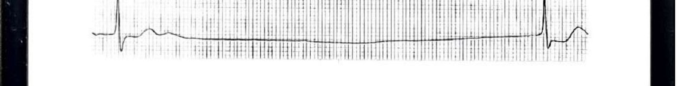
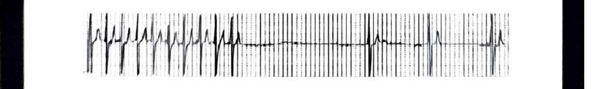
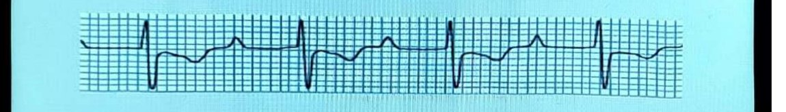
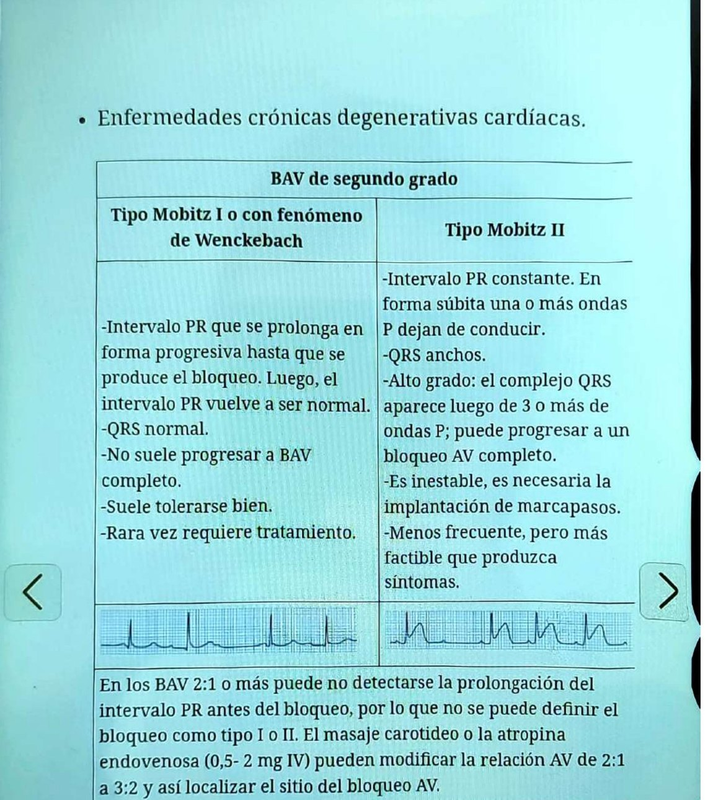
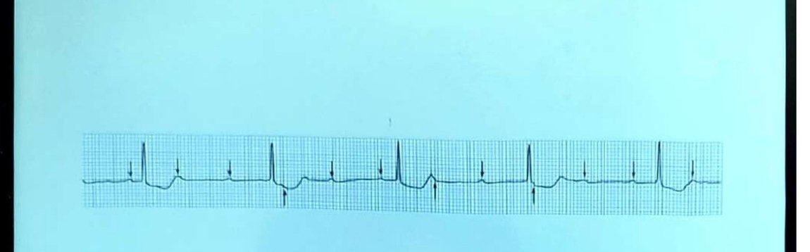

## Cuándo uso esta ficha
Frecuencia cardíaca menor de 60 lpm. Puede ser fisiológica o patológica.

**La regla de oro:** muchas bradicardias, incluso importantes, son asintomáticas y no tienen implicancia patológica. La mayoría de las personas tolera bien una frecuencia de hasta 40 lpm. **Hay que correlacionar los síntomas con el ECG:** eso es lo que define si hay que tratar.

## Clínica
Astenia, mareos, fatiga, letargia, presíncope, síncope, insuficiencia cardíaca, y también disnea, angina o deterioro cognitivo precoz. Los síntomas pueden ser permanentes, persistentes o imprevisibles, y también puede ser asintomática.

## Diagnóstico
- **ECG:** no siempre identifica la bradiarritmia, porque los signos de disfunción del nódulo sinusal pueden ser intermitentes. **Maniobra del seno carotídeo:** positiva cuando hay pausas sinusales mayores de 3 segundos. Limitación: en ancianos asintomáticos es frecuente ver pausas de más de 3 segundos como respuesta a la maniobra.
- **Holter de 24 o 48 horas:** no siempre detecta los episodios sintomáticos, porque la mayoría de los síncopes son paroxísticos e impredecibles.

## Enfermedad del nódulo sinusal
Arritmia frecuente, sobre todo en ancianos. La causa más común es la degeneración idiopática por fibrosis, o los fármacos: glucósidos cardíacos, betabloqueantes, bloqueantes cálcicos, amiodarona y otros antiarrítmicos. Tiene varias expresiones en el ECG.

**Bradicardia sinusal.** Ritmo regular con QRS precedidos de onda P sinusal y frecuencia menor de 60 lpm. Suele ser un hallazgo incidental, por aumento del tono vagal (fisiológico) o por fármacos, hipotiroidismo y alteraciones electrolíticas (patológico).

**Paro sinusal.** No se genera el impulso en forma transitoria: pausa mayor de 3 segundos, sin onda P.

**Bloqueo sinoauricular.** Falla en la conducción del miocardio auricular: ausencia intermitente de ondas P, ausencia de actividad auricular o marcapasos auricular ectópico subsidiario. **Difícil de diferenciar del paro sinusal**, salvo que el R-R sea múltiplo del R-R del latido previo a la bradicardia.

**Síndrome bradicardia-taquicardia.** Taquiarritmia auricular paroxística (en general aleteo o FA) seguida de bradicardia marcada o pausa sinusal, alternando períodos de una y otra.

## Bloqueo auriculoventricular

**BAV de primer grado.** Intervalo PR mayor de 0,20 segundos, constante, con onda P siempre seguida de QRS. **No produce bradicardia por sí mismo**: la produce cuando acompaña a la enfermedad del nódulo sinusal o a bloqueos de segundo o tercer grado. Puede verse en personas sanas mientras duermen.

**BAV de segundo grado.** Fallo intermitente de la conducción: algunas ondas P no son seguidas de QRS.
- *Mobitz I* se asocia a intoxicación digitálica, betabloqueantes y calcioantagonistas, y a IAM inferior o de VD.
- *Mobitz II* se asocia a IAM agudo anterior extenso y a enfermedades crónicas degenerativas cardíacas.

En los **BAV 2:1 o más** puede no detectarse la prolongación del PR previa al bloqueo, así que no se lo puede clasificar como tipo I o II. El masaje carotídeo o la atropina EV (0,5 a 2 mg) pueden modificar la relación AV de 2:1 a 3:2 y así localizar el sitio del bloqueo.

**BAV de tercer grado.** Actividad auricular y ventricular independientes: ondas P sin relación con los QRS.

## Tratamiento
1. **Manejo inicial:** soporte; en el paciente inestable, asegurar vía aérea, monitoreo cardíaco y **atropina EV 0,5 a 2 mg**.
2. **Suspender los fármacos** que puedan estar causando la bradicardia.
3. **Marcapasos transitorio transcutáneo:** en descompensación hemodinámica.
4. **Marcapasos permanente:** bradicardia sintomática de causa intrínseca o irreversible, o secundaria a fármacos que no pueden suspenderse; bloqueos AV infranodales de segundo o tercer grado; síndrome bradicardia-taquicardia. Los bicamerales (DDD) se asocian a mejor evolución a largo plazo, incluso con patología auricular.

## Trampas
- Una pausa mayor de 3 segundos con el masaje carotídeo en un anciano asintomático no es diagnóstico: es un hallazgo frecuente.
- Mobitz I se tolera bien y rara vez necesita tratamiento; Mobitz II es inestable y necesita marcapasos. Distinguirlos cambia la conducta.
- Un ECG normal no descarta: la disfunción sinusal es intermitente.

---
*Verificar dosis contra la página original: la ficha se armó sobre el OCR del escaneo.*
