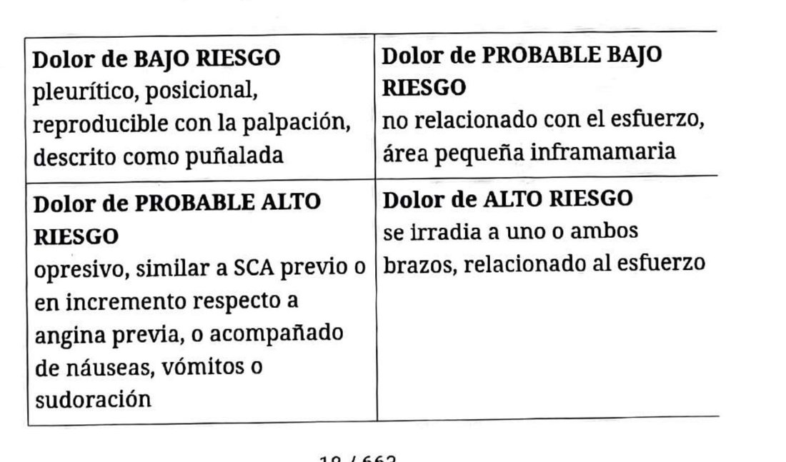

## Cuándo uso esta ficha
Adulto con dolor torácico no traumático.

## Diferenciales

**Más críticos:** síndrome coronario agudo, disección aórtica, taponamiento cardíaco, TEP, neumotórax a tensión, mediastinitis (por ejemplo, ruptura esofágica).

**Más frecuentes:** gastrointestinales (ERGE, espasmo esofágico, úlcera gastroduodenal, pancreatitis); osteomusculares (costocondritis, contractura, fractura o traumatismo); otras cardíacas (pericarditis, miocarditis, valvulopatías, ICC, miocardiopatía inducida por estrés o Takotsubo); respiratorias (pleuritis, neumonía, asma); neuropatía (herpes zóster); psiquiátricas (trastornos conversivos).

## Claves de cada cuadro
- **Disección aórtica:** dolor transfixiante, de inicio abrupto y máxima intensidad desde el comienzo, que migra a medida que avanza la disección. Mediastino ensanchado en la Rx. Asimetría de pulsos y TA diferencial entre miembros. Puede acompañarse de ACV, SCA, isquemia mesentérica o insuficiencia renal.
- **TEP:** dolor pleurítico, disnea súbita, asimetría de miembros inferiores, taquipnea y/o taquicardia.
- **Neumotórax hipertensivo:** dolor súbito, pleurítico, intenso, con disnea e hipoventilación unilateral.
- **Pericarditis aguda:** dolor pleurítico prolongado, mejora con la flexión del tronco y aumenta con la inspiración profunda, irradia a los trapecios. Cede con AINE y no con nitratos. Frote pericárdico. Infradesnivel del PR y supradesnivel del ST difuso.
- **Taponamiento:** ingurgitación yugular, hipotensión, pulso paradojal, hipovoltaje y alternancia eléctrica en el ECG.
- **Ruptura esofágica:** vómitos provocados o instrumentación esofágica reciente. Paciente séptico, febril, con crepitación mediastinal.
- **Espasmo esofágico:** se relaciona con la ingesta, puede haber disfagia y alivia con nitratos.
- **Osteomuscular:** bien localizado, se reproduce con la palpación y se modifica con los cambios posturales.

## Anamnesis

**1. Características del dolor:** aparición; localización (retroesternal, puntada de costado, generalizado, localizado); irradiación (mandíbula, cuello, brazos, espalda, ombligo); carácter (opresivo, punzante, transfixiante, urente); intensidad; atenuantes y agravantes.

**2. Comorbilidades y factores de riesgo:** HTA, diabetes, tabaquismo, dislipemia, obesidad, sedentarismo, resistencia a la insulina, vasculopatía periférica, insuficiencia renal crónica, edad (hombres >55, mujeres >65), antecedente familiar de enfermedad cardiovascular prematura (hombres <55, mujeres <65).

**3. Antecedentes:** cirugías cardíacas, arritmias, SCA previos, trauma, cirugía reciente, enfermedad oncológica, consumo de cocaína, Marfán.

**4. Estudios previos:** ecocardiograma transtorácico o transesofágico, cinecoronariografía, pruebas de esfuerzo, Holter.

**5. Episodios anteriores:** primer episodio o similares previos.

**6. Síntomas acompañantes:** sudoración, palpitaciones, disnea, náuseas y vómitos, fiebre, síncope.

## Estratificación del dolor
- **Alto riesgo:** se irradia a uno o ambos brazos, relacionado con el esfuerzo.
- **Probable alto riesgo:** opresivo, similar a un SCA previo o en aumento respecto de la angina habitual, o acompañado de náuseas, vómitos o sudoración.
- **Probable bajo riesgo:** no relacionado con el esfuerzo, área pequeña inframamaria.
- **Bajo riesgo:** pleurítico, posicional, reproducible con la palpación, descrito como puñalada.

## Examen físico
Signos vitales, presión y pulsos en ambos miembros, soplos, signos de sobrecarga (ingurgitación yugular, reflujo hepatoyugular, crepitantes, edemas), reproducibilidad del dolor a la palpación, miembros inferiores (edema, asimetría).

## Estudios complementarios

**1. ECG:** en los primeros 10 minutos, preferentemente intradolor. Incluir derivaciones derechas (V3R-V4R) y posteriores (V7-V8). Buscar cambios en ST-T, comparar con trazados previos, BCRI nuevo, S1Q3T3, microvoltajes y alternancia eléctrica. Puede ser normal: repetir si el paciente sigue sintomático y la sospecha clínica es alta.

**2. Marcadores de daño miocárdico**
- *Troponina T ultrasensible:* se detecta 3 horas después de la lesión y permanece elevada 7-10 días. Curva con valor basal (en ventana) y a las 3 horas. Positiva con valor >14 o con ascenso/descenso respecto del previo. No sirve ante sospecha de infarto recurrente temprano. Otras causas de elevación: isquemia secundaria (aumento del doble producto, vasoespasmo, estenosis aórtica), lesión no isquémica (miocarditis, contusión), TEP, sepsis, ICC grave, insuficiencia renal, Takotsubo.
- *CK-MB:* menor sensibilidad y especificidad. Útil en angina post-IAM o si la troponina ya estaba elevada. Positiva con relación CK-MB/CK >2,5.

**3. Laboratorio general:** hemograma, ionograma, función renal, proBNP, dímero D.

**4. Rx de tórax.**

**5. Según sospecha:** TC, angioTC, doppler venoso, RMN, ecocardiograma transtorácico o transesofágico, centellograma.

## Trampas
- Que ceda con nitratos no confirma origen coronario: el espasmo esofágico también cede.
- Un ECG normal no descarta nada si el dolor persiste y la sospecha es alta: se repite.
- El dolor atípico es más frecuente en diabéticos, mujeres y añosos.

---
*Verificar dosis y valores contra la página original: la ficha se armó sobre el OCR del escaneo.*
