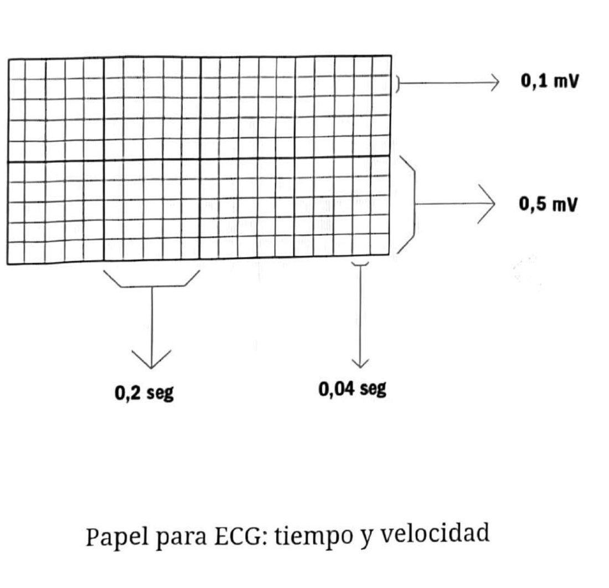
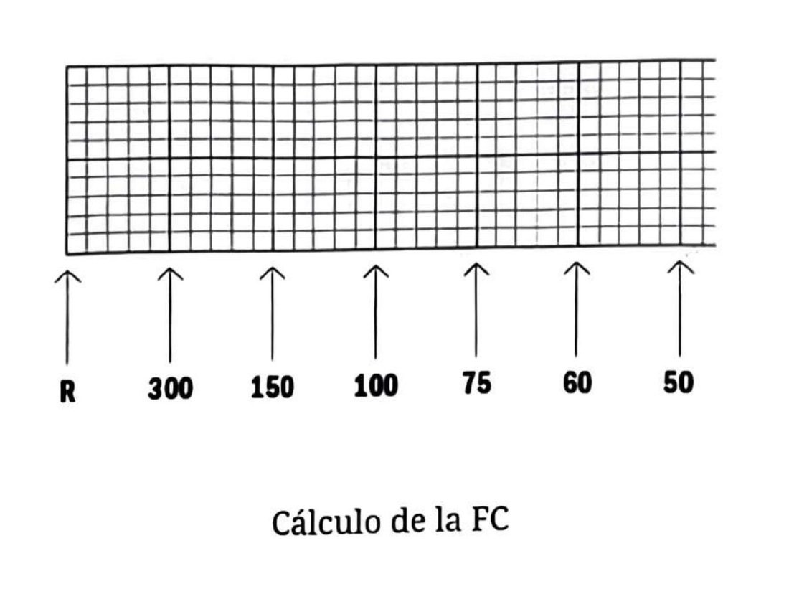
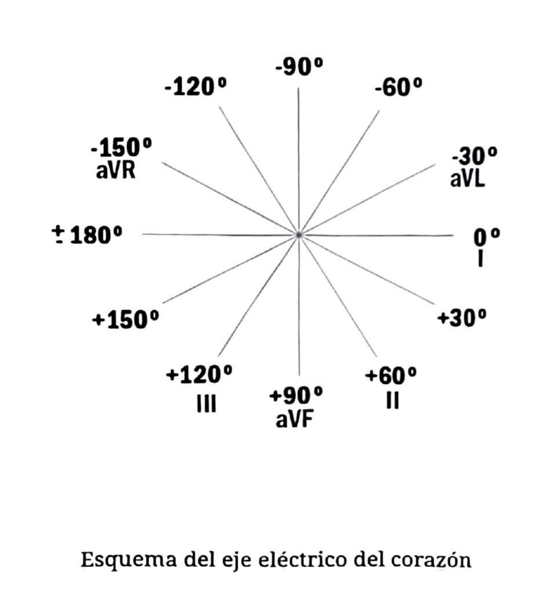
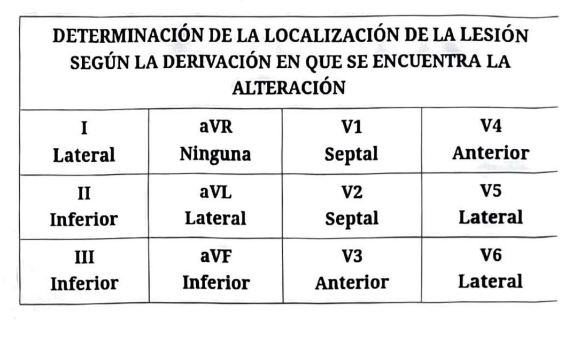

## Antes de leer: el estándar
Velocidad de corrida 25 mm/segundo. Voltaje 1 cm = 1 mV. **Siempre revisar el estándar del trazado antes de interpretar.** Cada cuadradito chico es 0,04 seg y cada cuadrado grande 0,2 seg.

## Valores normales
- **Onda P:** menos de 0,12 seg (3 cuadraditos) y menos de 0,25 mV (2,5 cuadraditos).
- **Intervalo PR:** 0,12 a 0,20 seg (3 a 5 cuadraditos). Puede variar con la frecuencia.
- **QRS:** 0,06 a 0,10 seg. No varía con la frecuencia.
- **Punto J:** intersección entre el final del QRS y el comienzo del ST.
- **Segmento ST:** isoeléctrico. Excepción: en taquicardia sinusal el punto J se deprime y el ST se hace ascendente, volviendo a ser isoeléctrico 0,08 seg después del fin del QRS.
- **Onda T:** asimétrica (asciende lento, desciende rápido). Su eje concuerda con el del QRS.
- **QT:** hasta 0,44 seg en varones, hasta 0,45-0,46 en mujeres. Corregir por frecuencia: QTc = QT dividido la raíz cuadrada del R-R en segundos.
- **Onda U:** más visible en V2-V4, menor de 0,2 mV, separada de la T. Se hace evidente en hipopotasemia, bradicardia, hipercalcemia y tratamiento con digoxina.

## Los cinco pasos

**1. Ritmo.** Es sinusal si: una onda P precede a cada QRS, el intervalo R-R es regular, la P es positiva en DI, aVF y V2 a V6 y negativa en aVR, y el PR está entre 0,12 y 0,20 seg.

**2. Frecuencia.** Normal 60 a 100 lpm. Cálculo exacto: 1500 dividido el intervalo R-R en milímetros. Estimación rápida: 300 dividido el R-R en cuadrados grandes, ubicando una R que coincida con una línea gruesa.

**3. Eje eléctrico.** Normal de -30° a +90°. Se puede determinar mirando solo DI, DII y aVF. La derivación isodifásica marca por dónde pasa el eje perpendicular.

**4. Comparar con ECG previos.**

**5. Definir la topografía de la lesión** según la derivación alterada.

| Derivación | Cara | Derivación | Cara |
|---|---|---|---|
| DI | Lateral | V1 | Septal |
| DII | Inferior | V2 | Septal |
| DIII | Inferior | V3 | Anterior |
| aVR | Ninguna | V4 | Anterior |
| aVL | Lateral | V5 | Lateral |
| aVF | Inferior | V6 | Lateral |

La correspondencia con la arteria comprometida está en la ficha de IAM con elevación del ST.

## Trampas
- Un QT que parece normal puede no serlo: siempre corregirlo por la frecuencia antes de decidir.
- Una onda U prominente es una pista de hipopotasemia, no un hallazgo decorativo.

---
*Verificar valores contra la página original: la ficha se armó sobre el OCR del escaneo.*
