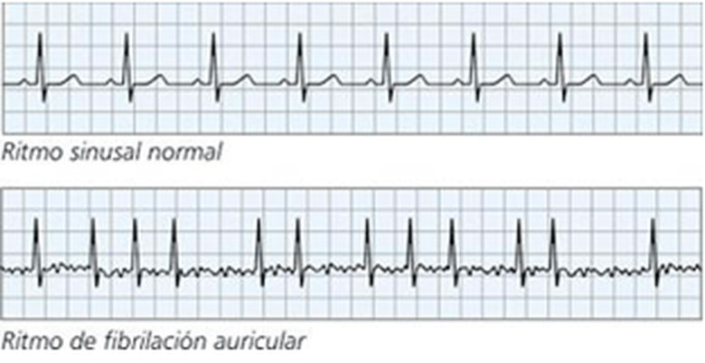
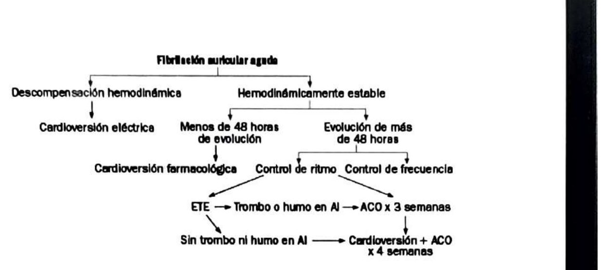
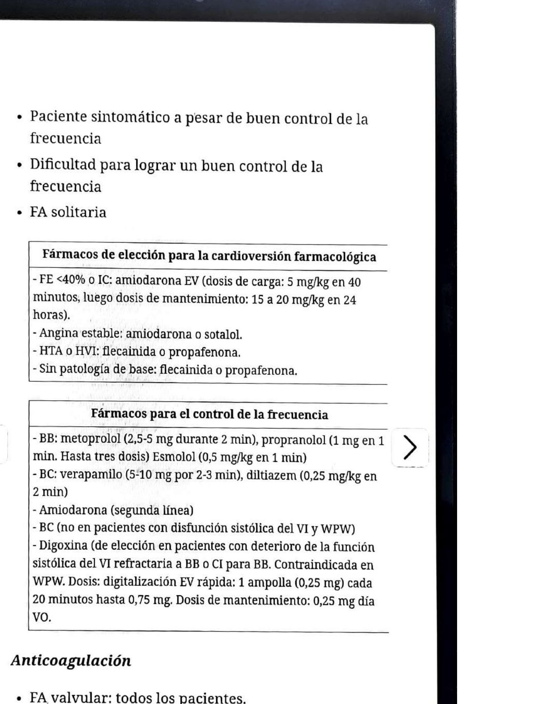
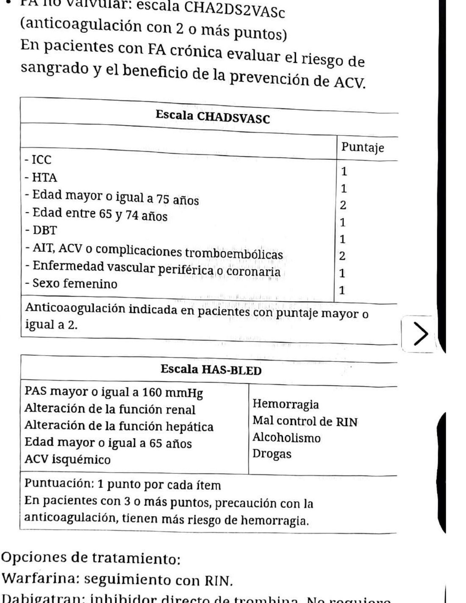

## Cuándo uso esta ficha
Palpitaciones o percepción de pulso irregular, hipotensión, insuficiencia cardíaca, angor, o síncope por bajo gasto (con alta o con baja respuesta ventricular).

## Signos de alarma
Angor, disnea, hipotensión, síncope o deterioro del nivel de conciencia, IC descompensada, edema agudo de pulmón, shock. Antecedente de Wolff-Parkinson-White, por el riesgo de degenerar en taquicardia ventricular.

## Clasificación
- **Aguda:** menos de 7 días, sin recurrencias.
- **Crónica:** más de 7 días o recurrente. Se subdivide en paroxística (episodios recurrentes autolimitados), persistente (más de 7 días, revierte solo con fármacos o cardioversión eléctrica) y permanente (más de 7 días, no cede con fármacos ni cardioversión, o se decide no intentar revertirla).
- **Aislada:** episodio en menores de 60 años sin evidencia clínica ni ecocardiográfica de cardiopatía.

## Desencadenantes que hay que buscar
Estrés, posoperatorio, intoxicación alcohólica aguda, fiebre, TEP, anemia, drogas de abuso, hipopotasemia, hipertiroidismo.

## Diagnóstico
1. **ECG:** ausencia de ondas P con respuesta ventricular irregular.

2. **Buscar causas reversibles** (fiebre, anemia, hipopotasemia, ICC) y pedir **ecocardiograma** para descartar patología estructural: tamaño auricular, valvulopatías, trombos.

## Algoritmo de la FA aguda
1. **¿Descompensación hemodinámica?** → cardioversión eléctrica.
2. **Estable, menos de 48 h de evolución** → se puede cardiovertir (farmacológica o eléctrica).
3. **Estable, más de 48 h o tiempo desconocido** → o control de frecuencia, o control de ritmo previo eco transesofágico:
   - Con trombo o humo en la aurícula izquierda: anticoagular 3 semanas.
   - Sin trombo ni humo: cardioversión y anticoagulación 4 semanas después.

## Indicaciones de cardioversión
Primer episodio; paciente sintomático a pesar de buen control de la frecuencia; dificultad para lograr un buen control de la frecuencia; FA solitaria.

## Control de ritmo: qué fármaco según el terreno
- **FE <40% o IC:** amiodarona EV (carga 5 mg/kg en 40 min, mantenimiento 15-20 mg/kg en 24 h).
- **Angina estable:** amiodarona o sotalol.
- **HTA o hipertrofia del VI:** flecainida o propafenona.
- **Sin patología de base:** flecainida o propafenona.

**Dosis**
- Flecainida: agudo 300 mg VO; mantenimiento 100-150 mg dos veces por día.
- Propafenona: agudo 450-600 mg VO; mantenimiento 150-300 mg tres veces por día.
- Ibutilida: 1 mg en 10 min. Sin mantenimiento.
- Dofetilida: 0,5 mg VO; mantenimiento 0,5 mg dos veces por día.
- Amiodarona: agudo 5-7 mg/kg EV en 30-60 min, seguido de 1 mg/min hasta 10 g; mantenimiento 200-400 mg/día.
- Sotalol: mantenimiento 80-160 mg/día.
- Dronedarona: 400 mg dos veces por día.

## Control de frecuencia
- **Betabloqueantes:** metoprolol 2,5-5 mg en 2 min; propranolol 1 mg en 1 min, hasta tres dosis; esmolol 0,5 mg/kg en 1 min.
- **Bloqueantes cálcicos:** verapamilo 5-10 mg en 2-3 min; diltiazem 0,25 mg/kg en 2 min. **No usar con disfunción sistólica del VI ni con WPW.**
- **Digoxina:** de elección con deterioro de la función sistólica refractario a betabloqueantes o con contraindicación para ellos. Contraindicada en WPW. Digitalización EV rápida: 1 ampolla (0,25 mg) cada 20 minutos hasta 0,75 mg; mantenimiento 0,25 mg/día VO.
- **Amiodarona:** segunda línea.

## Anticoagulación
- **FA valvular:** todos los pacientes.
- **FA no valvular:** CHA2DS2-VASc, anticoagular con 2 puntos o más.

**CHA2DS2-VASc:** ICC 1, HTA 1, edad ≥75 años 2, edad 65-74 años 1, diabetes 1, AIT/ACV o complicaciones tromboembólicas 2, enfermedad vascular periférica o coronaria 1, sexo femenino 1.

**HAS-BLED** (1 punto por ítem): PAS ≥160 mmHg, alteración de la función renal, alteración de la función hepática, edad ≥65 años, ACV isquémico, hemorragia previa, mal control de RIN, alcoholismo, drogas. Con 3 puntos o más, precaución: mayor riesgo de sangrado.

**Opciones:** warfarina con control de RIN. Dabigatrán 150 mg dos veces por día, rivaroxabán 20 mg/día o apixabán 5 mg dos veces por día, todos en FA no valvular y sin control de laboratorio. Menos recomendadas: AAS con clopidogrel, o AAS sola.

## Ablación por radiofrecuencia
Indicada en FA sintomática recurrente. Aísla las bandas de músculo auricular que rodean las venas pulmonares. Éxito del 50 al 80%.

## Trampas
- Los bloqueantes cálcicos son la opción cómoda para bajar la frecuencia, pero están contraindicados justo en los dos escenarios donde más tientan: disfunción sistólica del VI y WPW.
- El capítulo trae dos esquemas distintos de amiodarona (el general y el de FE <40%). Definir cuál se usa antes de llevar esto a la guardia.

---
*El trazado de ECG es una imagen de referencia, no proviene del libro. Verificar dosis contra la página original: la ficha se armó sobre el OCR del escaneo. La dosis de dabigatrán quedó ilegible en el escaneo y la completé con la dosis habitual en FA no valvular.*
