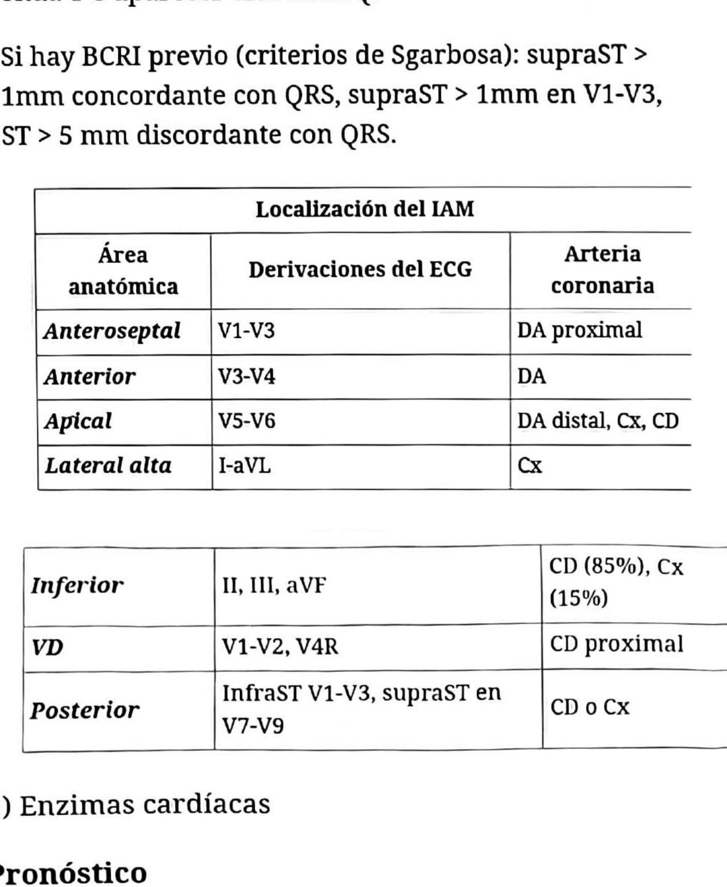
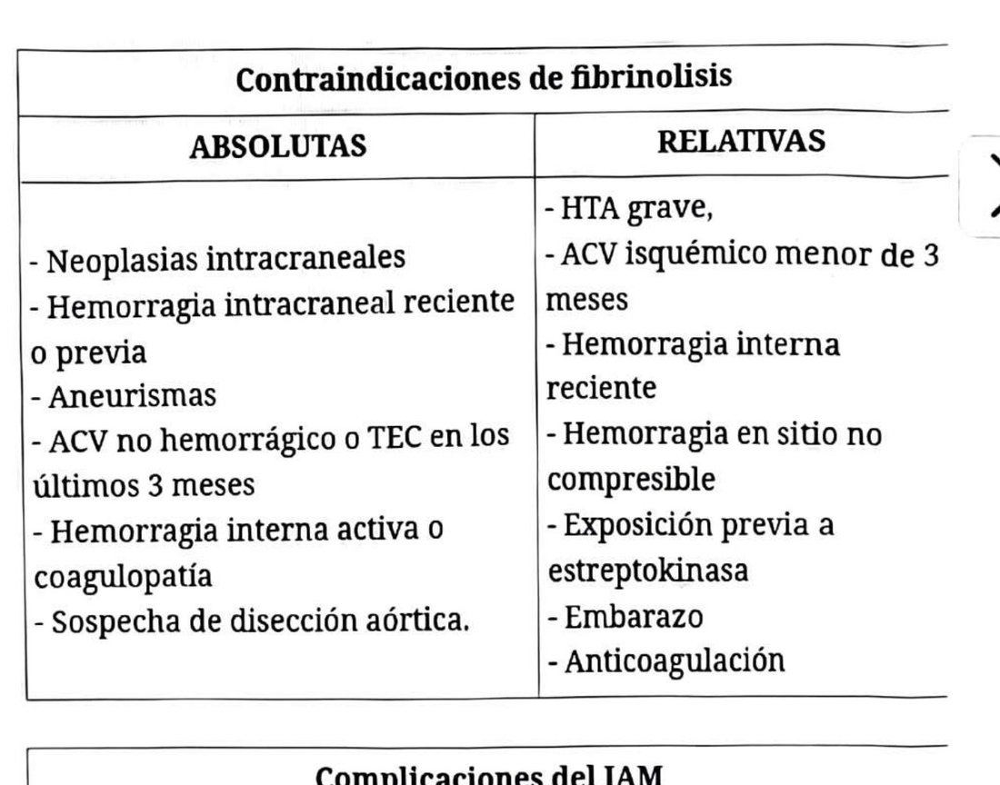

## Objetivo
Diagnóstico temprano y reperfusión inmediata. **No se espera el resultado de la curva enzimática.**

## Diagnóstico por ECG
- Elevación del ST en 2 o más derivaciones consecutivas, mayor de 1 mm, en la fase aguda.
- BCRI nuevo.
- IAM posterior: infradesnivel del ST en V1-V3 con R prominentes y supradesnivel en V7-V8.
- En la evolución puede invertirse la onda T o aparecer onda Q.
- **Con BCRI previo, criterios de Sgarbossa:** supra del ST >1 mm concordante con el QRS; infra del ST >1 mm en V1-V3; supra del ST >5 mm discordante con el QRS.

## Localización y arteria comprometida
| Cara | Derivaciones | Arteria |
|---|---|---|
| Anteroseptal | V1-V3 | DA proximal |
| Anterior | V3-V4 | DA |
| Apical | V5-V6 | DA distal, circunfleja o coronaria derecha |
| Lateral alta | D1, aVL | Circunfleja |
| Inferior | D2, D3, aVF | Coronaria derecha (85%), circunfleja (15%) |
| Ventrículo derecho | V1-V2, V4R | Coronaria derecha proximal |
| Posterior | Infra en V1-V3, supra en V7-V9 | Coronaria derecha o circunfleja |

## Pronóstico: Killip-Kimball
- **A:** sin ICC. Mortalidad 6%.
- **B:** tercer ruido o crepitantes hasta campos medios. Mortalidad 17%.
- **C:** edema agudo de pulmón. Mortalidad 30-40%.
- **D:** shock cardiogénico. Mortalidad 60-80%.

## Tratamiento
**Médico:** igual al de la angina inestable y el SCASEST (ver esa ficha), con la diferencia de que acá la reperfusión no se discute.

**Angioplastia primaria:** tiempo puerta-balón menor de 90 minutos. Indicada dentro de las 12 horas del inicio de los síntomas, con isquemia persistente entre las 12 y 24 horas, o en el paciente en shock. Es superior a la fibrinólisis: reduce 27% la mortalidad, 65% el IAM recurrente y 54% el ACV. Se prefiere el acceso radial. No se recomienda la aspiración del trombo (mayor tasa de ACV). La revascularización completa, comparada con tratar solo la arteria culpable, reduce el reinfarto no fatal y la necesidad de nueva revascularización; puede hacerse en el mismo procedimiento o diferida.

**Angioplastia de rescate:** ante falla de reperfusión, inestabilidad hemodinámica o persistencia de los síntomas.

**Fibrinólisis:** en pacientes con síntomas de menos de 12 horas de evolución. Tiempo puerta-aguja menor de 30 minutos.

### Contraindicaciones de la fibrinólisis
- **Absolutas:** neoplasias intracraneales; hemorragia intracraneal reciente o previa; aneurismas; ACV no hemorrágico o TEC en los últimos 3 meses; hemorragia interna activa o coagulopatía; sospecha de disección aórtica.
- **Relativas:** HTA grave; ACV isquémico de menos de 3 meses; hemorragia interna reciente; hemorragia en sitio no compresible; exposición previa a estreptoquinasa; embarazo; anticoagulación.

*El ACV de menos de 3 meses figura en las dos columnas de la tabla del libro (como absoluta si es "no hemorrágico" y como relativa si es "isquémico"). En la práctica se toma como contraindicación absoluta.*

## Complicaciones del IAM
Disfunción ventricular, shock cardiogénico, IAM recurrente, arritmias (FV o TV: primera causa de mortalidad extrahospitalaria), pericarditis, tromboembolismo, aneurisma ventricular, seudoaneurisma, ruptura de miocardio, ruptura del tabique interventricular, insuficiencia mitral, y síndrome de Dressler (fiebre, pleuritis, pericarditis y neumonitis por reacción autoinmune, pasadas dos semanas del IAM).

## Prevención secundaria a largo plazo
AAS 81 mg; ticagrelor, prasugrel o clopidogrel por al menos 12 meses; betabloqueante; estatina en dosis alta; IECA o ARA II si hay ICC, diabetes, HTA o enfermedad renal crónica. Nitratos solo como tratamiento sintomático, no cambian la mortalidad. Anticoagulación si coexiste FA o trombo mural. CDI si hubo extrasistolia o taquicardia ventricular a partir del segundo día del evento. Ecocardiograma antes del alta para evaluar la función sistólica del VI.

---
*Verificar dosis contra la página original: la ficha se armó sobre el OCR del escaneo. La tabla de contraindicaciones está transcripta de la imagen, no del OCR.*
