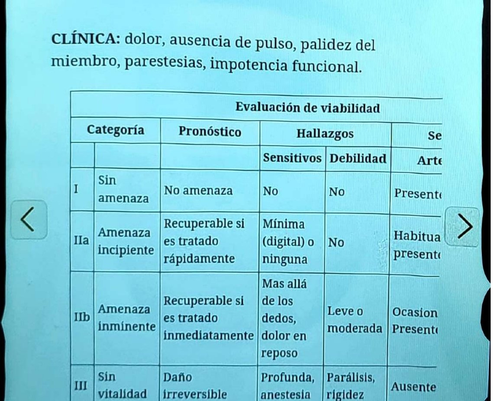
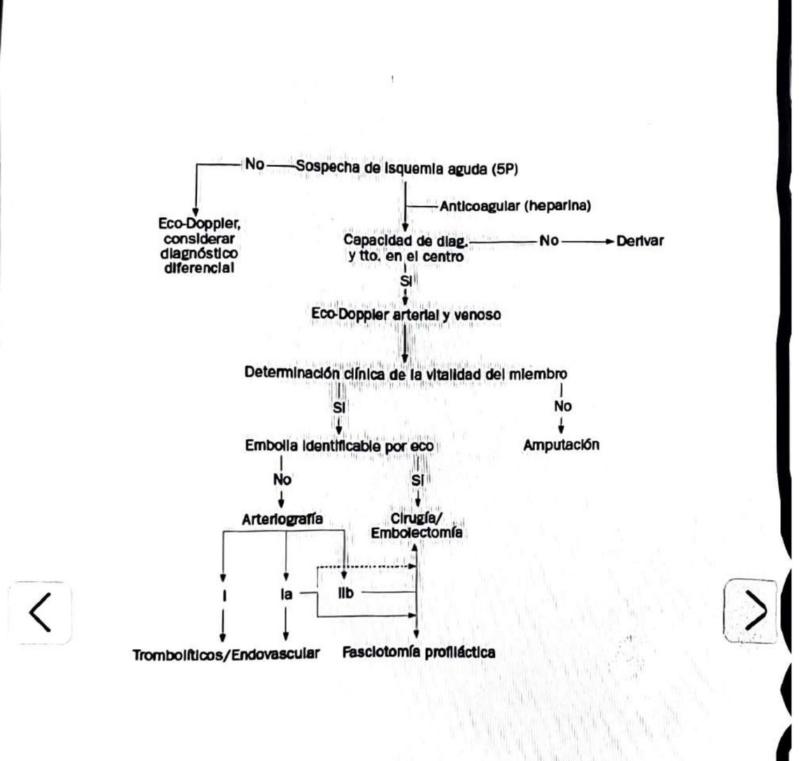

## A quién le pasa
La enfermedad vascular periférica afecta al 4% de los mayores de 40 años, al 15-20% de los mayores de 65 y al 27% de los diabéticos. Más frecuente en hombres. **Se asocia a enfermedad vascular en otros lechos:** en un rastreo con cinecoronariografía en pacientes con EVP, solo el 8% tenía coronarias normales.

# Isquemia arterial aguda

**Es una emergencia.** Disminución súbita de la perfusión que amenaza la viabilidad del miembro, de menos de dos semanas de evolución. Tasa de amputación del 25% y mortalidad del 10 al 20%.

## Causas
- **Trombosis:** la más frecuente, sobre territorios previamente afectados o en pacientes con trombofilia.
- **Embolia** cardíaca o arterial. **Sospecharla especialmente en FA, infartos extensos con disfunción ventricular y válvulas protésicas con anticoagulación en subrango.**
- Traumatismo.
- Disección.

## Clínica: las 5 P
Dolor, ausencia de pulso, palidez del miembro, parestesias e impotencia funcional.

## Evaluación de viabilidad
- **I, sin amenaza:** sin déficit sensitivo ni debilidad. No hay amenaza inmediata.
- **IIa, amenaza incipiente:** déficit sensitivo mínimo (digital) o ninguno, sin debilidad. **Recuperable si se trata rápidamente.**
- **IIb, amenaza inminente:** déficit sensitivo más allá de los dedos con dolor en reposo, debilidad leve o moderada. **Recuperable solo si se trata de inmediato.**
- **III, sin vitalidad:** anestesia profunda, parálisis y rigidez. **Daño irreversible.**

## Conducta
1. **Anticoagular con heparina DE INMEDIATO ante la sospecha:** disminuye la mortalidad y el riesgo de amputación. No se espera confirmación.
2. Eco-Doppler arterial y venoso; considerar diagnósticos diferenciales.
3. Evaluación clínica de la vitalidad del miembro.
4. Si la embolia es identificable por eco: arteriografía, o cirugía y embolectomía según el caso; en otras situaciones, trombolíticos o tratamiento endovascular, con fasciotomía profiláctica.
5. **Si no hay complejidad adecuada para tratarlo, derivar** a un centro de mayor complejidad.
6. **Si el miembro no es viable clínicamente, es una emergencia y corresponde amputación.**

## Síndrome de reperfusión
Daño tisular por isquemia con acumulación de grandes cantidades de ácido láctico. Al reperfundir se generan radicales libres que destruyen la porción lipídica de las membranas y aumentan la permeabilidad capilar.
- **Local:** síndrome compartimental.
- **Sistémico:** el lactato liberado en la anaerobiosis causa acidosis e hiperpotasemia (arritmias), y la mioglobina liberada genera insuficiencia renal aguda y acidosis.

## Trampas
- La anticoagulación va ante la sospecha, no después del eco-Doppler.
- Un paciente con FA y anticoagulación en subrango que llega con un miembro frío es una embolia hasta que se demuestre lo contrario.
- Reperfundir un miembro no viable puede matar al paciente por hiperpotasemia y acidosis.

---
*Verificar contra la página original: la ficha se armó sobre el OCR del escaneo. En la tabla de viabilidad, las columnas de la derecha (señales Doppler arterial y venosa) quedaron cortadas en el escaneo; conviene completarlas desde el libro.*
