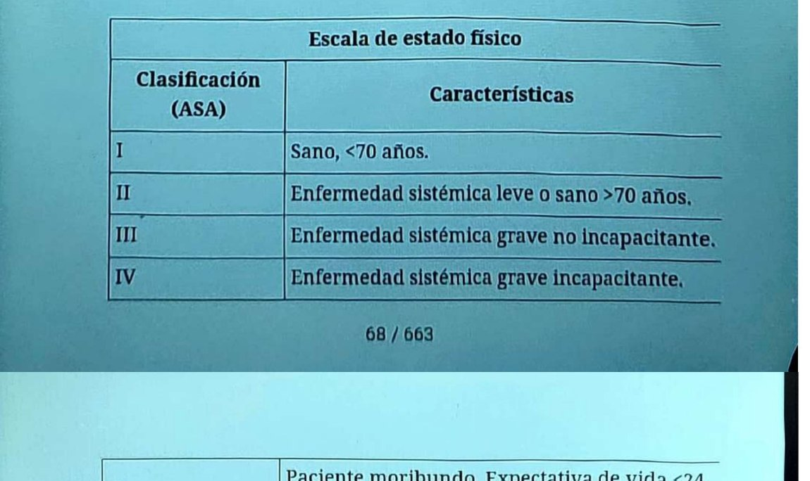
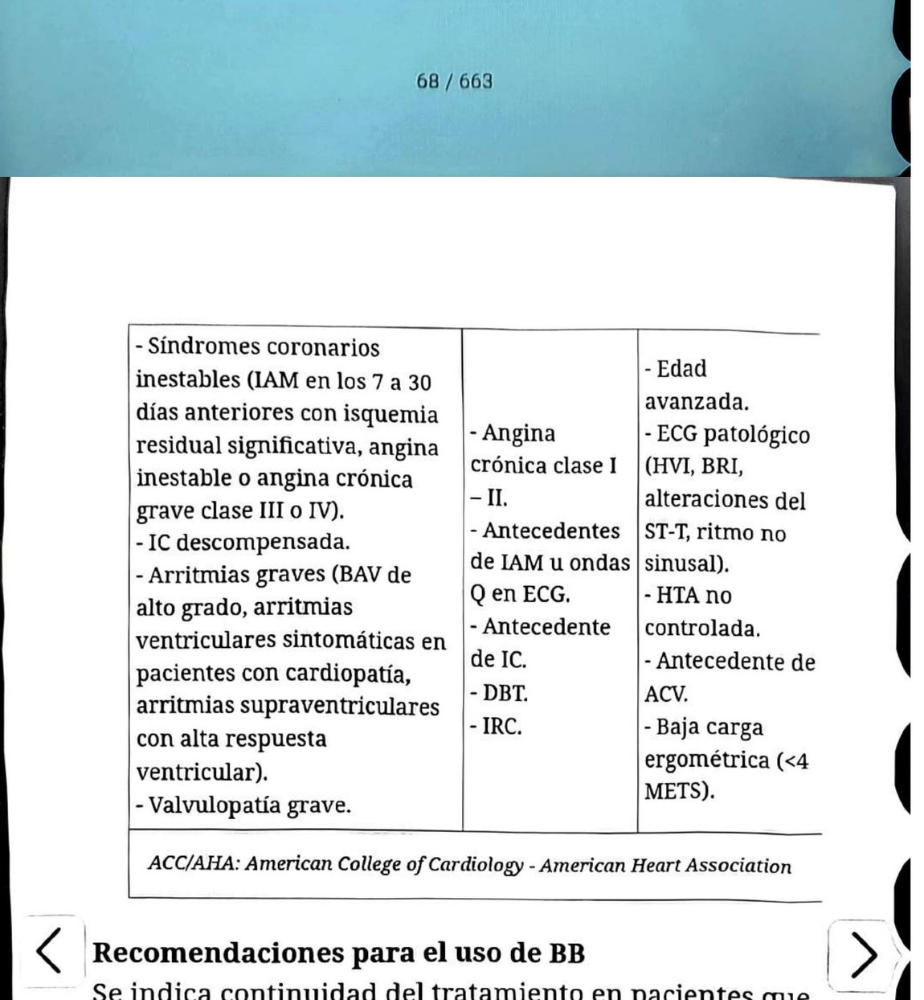
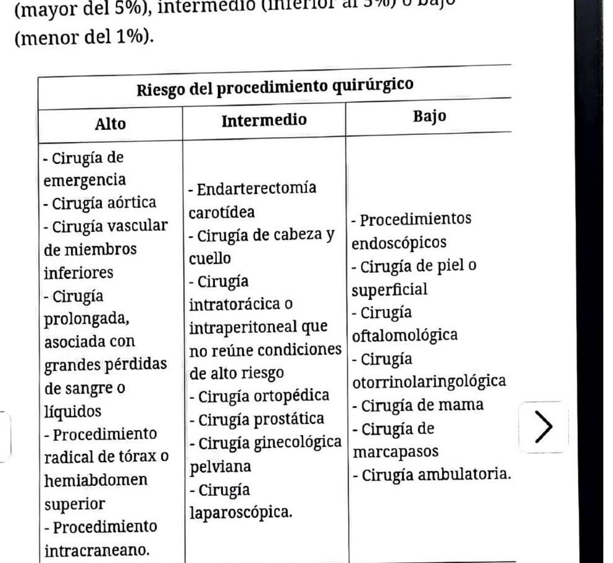
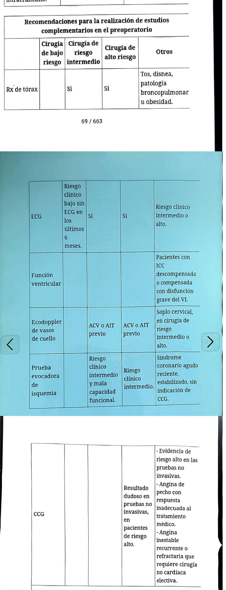
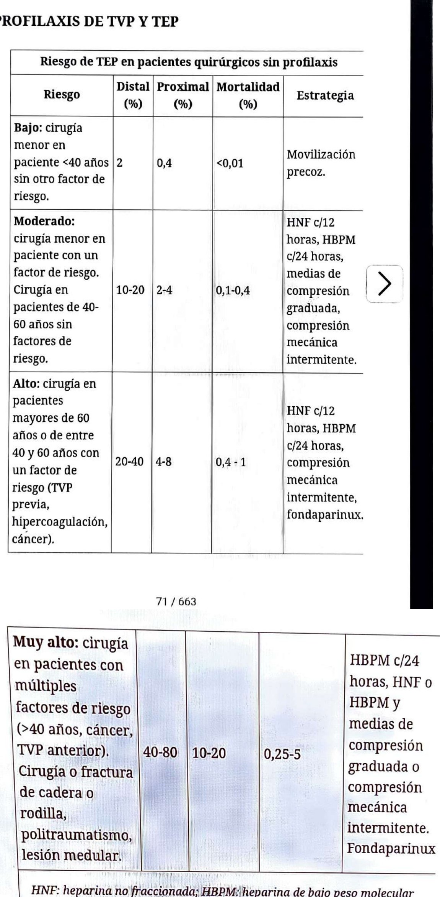

## Para qué sirve
Valorar la estabilidad cardiovascular y la condición médica del paciente ante una enfermedad con indicación quirúrgica. **En pacientes no seleccionados sometidos a cirugía general, el 30% tiene coronariopatía establecida o alto riesgo de presentarla, y entre el 3 y el 5% tendrá complicaciones cardíacas asociadas a eventos coronarios.**

## 1. Riesgo clínico del paciente
Identificar **enfermedades cardíacas graves**: síndromes coronarios inestables, angina, IAM reciente o pasado, insuficiencia cardíaca descompensada, arritmias y enfermedad valvular grave. Y evaluar el **estado funcional**: 4 METS equivalen a subir dos tramos de escalera o caminar cuatro cuadras.

**Escala de estado físico (ASA):** I, sano menor de 70 años. II, enfermedad sistémica leve, o sano mayor de 70. III, enfermedad sistémica grave no incapacitante. IV, enfermedad sistémica grave incapacitante. V, paciente moribundo con expectativa de vida menor de 24 horas sin la cirugía.

**Estado funcional en METS** (1 MET = 3,5 mL de absorción de O₂/kg/min):
- 1 MET: puede cuidarse solo, comer, vestirse, usar el baño.
- 4 MET: puede subir un tramo de escaleras o una colina, o caminar en llano a 3 o 4 mph.
- 4 a 10 MET: trabajos pesados en casa, lavar pisos, mover muebles, subir dos tramos de escaleras.
- Más de 10 MET: deportes intensos.

**Riesgo mayor** si tiene dificultad con las actividades de la vida diaria, o no puede caminar cuatro cuadras ni subir dos tramos de escalera (no alcanza los 4 METS). **Riesgo menor** si está inactivo pero sin limitaciones, o es activo y hace ejercicios vigorosos con regularidad.

**Estratificación según ACC/AHA:**
- **Alto:** síndromes coronarios inestables (IAM en los 7 a 30 días previos con isquemia residual significativa, angina inestable o angina crónica grave clase III o IV); insuficiencia cardíaca descompensada; arritmias graves (BAV de alto grado, arritmias ventriculares sintomáticas en cardiópatas, supraventriculares con alta respuesta ventricular); valvulopatía grave.
- **Intermedio:** angina crónica clase I o II; antecedentes de IAM u ondas Q en el ECG; antecedente de insuficiencia cardíaca; diabetes; insuficiencia renal crónica.
- **Bajo:** edad avanzada; ECG patológico (hipertrofia del VI, bloqueo de rama, alteraciones del ST-T, ritmo no sinusal); HTA no controlada; antecedente de ACV; baja carga ergométrica (menos de 4 METS).

## 2. Riesgo del procedimiento
Según la incidencia combinada de muerte cardíaca e IAM no fatal: **alto** (mayor del 5%), **intermedio** (menor del 5%) y **bajo** (menor del 1%).
- **Alto:** cirugía de emergencia, cirugía aórtica, cirugía vascular de miembros inferiores, cirugía prolongada asociada a grandes pérdidas de sangre o líquidos.
- **Intermedio:** endarterectomía carotídea, cirugía de cabeza y cuello, intratorácica o intraperitoneal que no reúne condiciones de alto riesgo, ortopédica, prostática, ginecológica.
- **Bajo:** procedimientos endoscópicos, cirugía de piel o superficial, oftalmológica, otorrinolaringológica, de mama, de marcapasos, cirugía ambulatoria.

## 3. Estudios complementarios preoperatorios
Se piden según el cruce entre el riesgo del paciente y el del procedimiento: ECG, evaluación de la función ventricular, ecodoppler de vasos de cuello, prueba evocadora de isquemia y cinecoronariografía tienen cada uno su indicación precisa.

## 4. Betabloqueantes
- **Continuar** el tratamiento en pacientes que ya los reciben.
- **Iniciarlos** en quienes tienen enfermedad coronaria establecida o riesgo alto de presentarla, y en individuos con HTA no controlada.
- **Titular la dosis 5 a 7 días antes** de la cirugía no cardíaca.

## 5. Profilaxis de TVP y TEP
Riesgo de TEP en pacientes quirúrgicos sin profilaxis, y estrategia según nivel:
- **Bajo** (cirugía menor en menor de 40 años sin otro factor de riesgo): TVP distal 2%, proximal 0,4%, mortalidad menor de 0,01%. **Movilización precoz.**
- **Moderado** (cirugía menor con un factor de riesgo, o cirugía en pacientes de 40 a 60 años sin factores): distal 10-20%, proximal 2-4%, mortalidad 0,1-0,4%. **HNF cada 12 horas, HBPM cada 24 horas, medias de compresión graduada o compresión mecánica intermitente.**
- **Alto** (mayores de 60 años, o de 40 a 60 con un factor de riesgo como TVP previa, hipercoagulabilidad o cáncer): distal 20-40%, proximal 4-8%, mortalidad 0,4-1%. **HNF cada 12 horas, HBPM cada 24 horas, compresión mecánica intermitente, fondaparinux.**
- **Muy alto** (múltiples factores de riesgo, cirugía o fractura de cadera o rodilla, politraumatismo, lesión medular): distal 40-80%, proximal 10-20%, mortalidad 0,25-5%. **HBPM cada 24 horas, HNF o HBPM más medias de compresión graduada o compresión mecánica intermitente, fondaparinux.**

**Situaciones particulares:** en cirugía de cadera se aconseja HBPM. En neurocirugía, compresión neumática intermitente con vendas elásticas o sin ellas, agregando HBPM en pacientes seleccionados de alto riesgo. En daño espinal agudo con parálisis de miembros inferiores, HBPM más vendas elásticas y compresión neumática intermitente. En politraumatizados, HBPM; si está contraindicada, compresión neumática intermitente. **En pacientes de riesgo muy alto, valorar filtro de vena cava.**

## Trampas
- El estado funcional pesa tanto como los antecedentes: un paciente que no sube dos pisos ya es de riesgo mayor, aunque el ECG sea normal.
- Suspender el betabloqueante antes de una cirugía es un error: se continúa.
- Un procedimiento "menor" en un paciente de alto riesgo clínico sigue siendo de alto riesgo.

---
*Verificar contra la página original: la ficha se armó sobre el OCR del escaneo, y varias de estas tablas quedaron desarmadas en el texto. Las imágenes son la referencia; el texto está para que el buscador las encuentre.*
