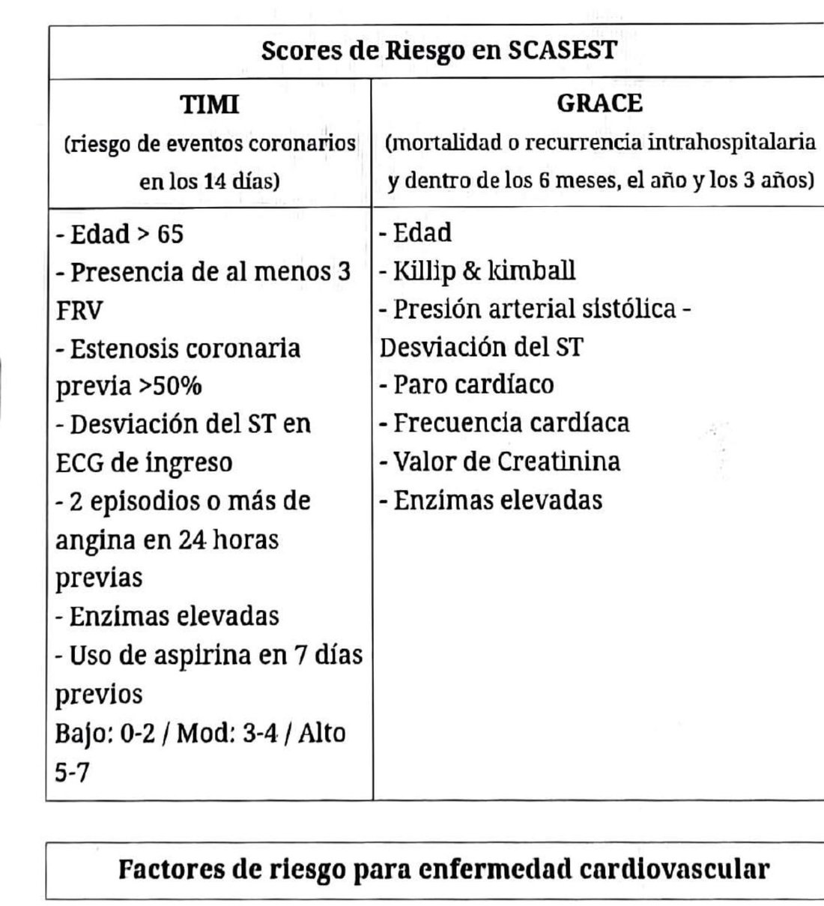

## Definición de IAM
Necrosis miocárdica en contexto de isquemia aguda. Requiere curva enzimática positiva (al menos un valor por encima del límite normal) más uno de estos criterios: síntomas de isquemia, cambios agudos de ST-T o BCRI nuevo, ondas Q patológicas, alteraciones regionales nuevas de la motilidad, o trombo coronario en la cinecoronariografía.

**Tipos:** 1, accidente de placa. 2, desbalance entre oferta y demanda de oxígeno o vasoespasmo. 3, muerte de causa cardíaca secundaria a infarto. 4 y 5, asociados a procedimientos de revascularización.

## Clasificación
- **Angina inestable:** de reciente comienzo (menos de 2 meses), progresiva, de reposo o ante esfuerzos mínimos, o prolongada. Oclusión coronaria subtotal. Biomarcadores negativos.
- **IAM sin elevación del ST:** igual cuadro, con enzimas elevadas.
- **IAM con elevación del ST:** oclusión coronaria total (ver ficha propia).

## Clínica
Dolor de más de 20 minutos (angina inestable) o más prolongado (IAM), de inicio gradual, parecido a dolores anginosos previos. Retroesternal y difuso. Irradia a uno o ambos hombros, antebrazo, mano, espalda, región interescapular, cuello, mandíbula, dientes y epigastrio. Opresivo o constrictivo, intenso, empeora con la actividad física y mejora con el reposo.

Puede acompañarse de disnea, náuseas, sudoración fría, eructos, mareos, debilidad, ansiedad y sensación de muerte inminente.

**Equivalentes anginosos** (sobre todo en añosos): disnea, alteración de la conciencia, síndrome confusional, arritmias, hipotensión. El dolor atípico es más frecuente en diabéticos, mujeres y añosos.

## ECG
Infradesnivel del ST (horizontalizado o descendente), ondas T negativas en alguna cara, o R prominentes con relación R/S >1. La diferencia entre angina inestable e IAM sin supra la da la elevación de enzimas, no el ECG.

## Scores de riesgo
- **TIMI** (riesgo de eventos coronarios a 14 días): edad >65; al menos 3 factores de riesgo cardiovascular; estenosis coronaria previa >50%; desviación del ST en el ECG de ingreso; 2 o más episodios de angina en las 24 h previas; enzimas elevadas; uso de aspirina en los 7 días previos. Bajo 0-2, moderado 3-4, alto 5-7.
- **GRACE** (mortalidad o recurrencia intrahospitalaria y a 6 meses, 1 año y 3 años): edad, clase de Killip-Kimball, presión arterial sistólica, desviación del ST, paro cardíaco, frecuencia cardíaca, creatinina, enzimas elevadas.

## Tratamiento inmediato
1. **ABC y monitoreo.**
2. **Antiagregación:** AAS 325 mg masticada (puede omitirse si ya la recibe a diario), luego 100 mg/día. Más un segundo antiagregante: ticagrelor 180 mg de carga y 90 mg cada 12 h (de elección); clopidogrel 300 mg de carga sin supra o 600 mg con supra, luego 75 mg/día (se prefiere solo si hay riesgo aumentado de sangrado); prasugrel 60 mg de carga y 10 mg/día.
3. **Anticoagulación:** heparina en goteo, bolo 60 U/kg IV (máx. 4000 U) y mantenimiento 12 U/kg/h (máx. 1000 U/h) por 48 h. O enoxaparina 1 mg/kg cada 12 h. Inhibidores IIb/IIIa no de rutina, solo en algunos pacientes con angioplastia.
4. **Antianginoso:** nitroglicerina sublingual o IV en goteo, titulando hasta el alivio del dolor o la caída de la TA. Contraindicada con inhibidores de PDE-5 (sildenafil) en las 24 h previas, riesgo de infarto de VD, estenosis aórtica o hipotensión. Morfina 2-4 mg IV cada 5-15 min si el dolor no cede con nitratos (hay evidencia de peor pronóstico). Betabloqueante, preferentemente cardioselectivo, contraindicado con FC <50 lpm, PAS <90 mmHg, falla de bomba o bloqueo AV de segundo o tercer grado.
5. **Oxígeno** solo si la saturación es <90% al aire ambiente.
6. **Estatinas en dosis altas:** rosuvastatina 20 o 40 mg, o atorvastatina 80 mg/día.

**La trombolisis está contraindicada.**

## Estrategia invasiva según riesgo
- **Muy alto riesgo** (shock cardiogénico, ICC o disfunción severa del VI, angina recurrente pese a tratamiento intensivo, inestabilidad hemodinámica por complicaciones mecánicas como insuficiencia mitral aguda o CIV, arritmias ventriculares): angioplastia de urgencia, dentro de las 2 horas.
- **Alto riesgo** (TIMI >5, GRACE >140, infradesnivel del ST en 2 o más derivaciones contiguas, curva enzimática positiva): angioplastia temprana, 12-24 horas.
- **Riesgo intermedio** (GRACE 109-140, TIMI ≥2, angina post-IAM, FEy <40%, diabetes, enfermedad renal crónica, cirugía de revascularización previa o angioplastia en los 6 meses previos): angioplastia diferida, 24-72 horas.

## Al alta: prevención secundaria
AAS, betabloqueante, estatina en dosis alta, e IECA o ARA II si hay ICC, diabetes, HTA o enfermedad renal crónica.

---
*Verificar dosis contra la página original: la ficha se armó sobre el OCR del escaneo.*
