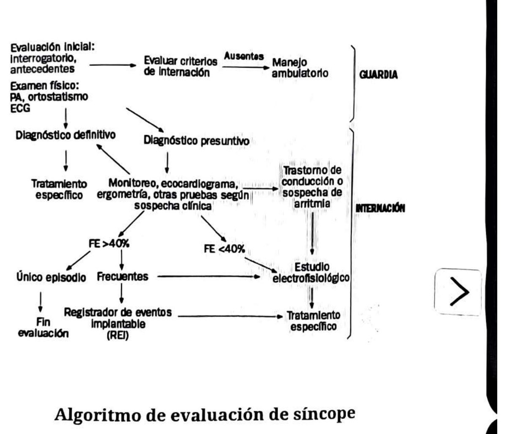

## Definición
Pérdida transitoria y abrupta de la conciencia con pérdida del tono postural, secundaria a hipoperfusión cerebral, con recuperación espontánea. Las lipotimias a veces se evalúan igual que el síncope.

Presentación bimodal: de 10 a 30 años y en mayores de 70. El pronóstico depende de la patología de base.

## Lo que hay que resolver en la guardia
**Determinar si el síncope es consecuencia de algo que pone en riesgo la vida.** Con interrogatorio, examen físico y ECG se identifica el 50% de las causas.

Los más frecuentes son los neuromediados o neurocardiogénicos (35%), y dentro de ellos el vasovagal (30%). El síncope cardíaco es el 20% y su causa más frecuente son las bradiarritmias (11%). **Los neuromediados van precedidos de pródromos.**

**El factor predictivo de muerte más importante es el antecedente de enfermedad cardíaca estructural.** La mortalidad al año del síncope de origen cardíaco es del 30%.

| Grupo | Causas |
|---|---|
| Neurocardiogénico | Vasovagal, del seno carotídeo, situacional |
| Ortostático | Depleción de volumen, fármacos, disautonomía (alcohol, diabetes, uremia, Parkinson, Alzheimer) |
| Cardiogénico | Eléctrico: TPS, TV, BAV. Estructural: ICC, hipertensión pulmonar, estenosis aórtica, miocardiopatía hipertrófica |

**Diferenciales:** neurológicos (migraña, convulsiones, insuficiencia vertebrobasilar), metabólicos (hipoxia, hipoglucemia, intoxicación) y psicógenos (trastorno de ansiedad, ataque de pánico con alcalosis respiratoria, somatización).

## Interrogatorio
- **Número de episodios:** único o varios a lo largo de muchos años, en general benignos. Múltiples episodios en poco tiempo sugieren etiología más grave.
- **Síntomas asociados:** disnea súbita (TEP); precordialgia (IAM, isquemia); foco neurológico (causa neurológica); náuseas, vómitos, sudoración y palidez (vasovagal); relajación de esfínteres (sugiere convulsión); cefalea (hemorragia subaracnoidea).
- **Pródromos:** náuseas, mareos, sudoración y palidez (vasovagal); auras (convulsiones); **sin pródromos es signo de alarma.**
- **Posición:** parado (vasovagal); al pasar de supina a bipedestación (ortostatismo) o de acostado a sentado (arritmia); pérdida súbita (arritmia).
- **Situacional:** precedido por tos, micción o defecación.
- **Duración:** breve (vasovagal, arritmias); prolongada (convulsiones, estenosis aórtica).
- **Recuperación:** en menos de 5 minutos, síncope; en más de 5 minutos, convulsión.
- **Preguntar a un tercero** por movimientos involuntarios y síntomas acompañantes.
- **Síncope con el ejercicio:** pensar en miocardiopatía hipertrófica obstructiva, TV, estenosis aórtica, WPW.
- **Enfermedades preexistentes:** psiquiátricas, cardíacas, diabetes.
- **Medicación:** betabloqueantes, alfabloqueantes, bloqueantes cálcicos, vasodilatadores, diuréticos, antiarrítmicos, antidepresivos, antipsicóticos.
- **Datos que sugieren crisis comicial:** relajación de esfínteres, mordedura lateral de lengua, confusión posterior, duración prolongada, desviación de la cabeza, postura inusual. Entre el 5 y el 15% de los diagnósticos presuntivos de síncope son en realidad un trastorno convulsivo.
- **Antecedentes familiares:** muerte súbita o enfermedad cardiovascular temprana (antes de los 50 años) aumenta el riesgo de síncope cardíaco.

## Examen físico
- Presión arterial con evaluación de ortostatismo (caída de 20 mmHg de la sistólica o aumento de 20 lpm de la frecuencia), **tomada en ambos brazos**: una diferencia entre brazos obliga a pensar en disección de aorta o robo de subclavia.
- Frecuencia cardíaca (FA, TV, WPW, bradiarritmias) y frecuencia respiratoria.
- Auscultación cardíaca con maniobras (estenosis aórtica, estenosis mitral, miocardiopatía hipertrófica obstructiva).
- Examen neurológico.
- Buscar signos directos e indirectos de sangrado.
- **Masaje del seno carotídeo** (controvertido): compresión continua por encima del cartílago tiroideo, a nivel del ángulo de la mandíbula, en forma circular, aumentando la presión durante 5 segundos. Positivo si aparece BAV paroxístico, pausa sinusal mayor de 3 segundos, o caída de 50 mmHg de la sistólica y 30 de la diastólica, con síntomas. *Indicado* ante síncope al girar la cabeza, usar corbata o afeitarse, con estudios cardiológicos y neurológicos negativos. *Contraindicado* con IAM en los 3 meses previos, AIT, ACV, TV, FV o soplo carotídeo.

## Estudios
- **ECG a todos los pacientes.** Bajo rédito diagnóstico, pero identifica arritmias e isquemia. Evaluar frecuencia, ritmo, trastornos de conducción, BAV de primer grado, bloqueo de rama, bloqueo bi y trifascicular, isquemia aguda, secuela anterior e intervalo QT.
- **Laboratorio según contexto:** hipoglucemia, alteraciones del ionograma, enzimas cardíacas, caída del hematocrito. Test de embarazo en mujeres en edad fértil.
- **TC de cerebro:** ante sospecha de ACV o hallazgos en el examen físico.
- **Ecocardiograma transtorácico:** para evaluar alteraciones estructurales; mayor utilidad en pacientes con enfermedad cardíaca o ECG alterado.

## Estratificación de riesgo
Es de alto riesgo si hay alguna de estas: ECG patológico; antecedente de cardiopatía estructural o signos de ICC; hematocrito menor del 30%; presión sistólica menor o igual a 90 mmHg; disnea; edad avanzada y comorbilidades; antecedente familiar de muerte súbita.

## Indicaciones de internación
- **Para diagnóstico:** cardiopatía, ECG anormal, síncope durante el ejercicio, historia familiar de muerte súbita.
- **Para tratamiento:** arritmias, síncope por isquemia, síncope por cardiopatía, síncope cardioinhibitorio para implante de marcapasos.
- **Para monitorización:** en los casos con lesión grave.

## Trampas
- Síncope sin pródromos, en decúbito o durante el esfuerzo: no es vasovagal hasta que se demuestre.
- La recuperación que tarda más de 5 minutos orienta a convulsión, no a síncope.
- Diferencia de tensión entre ambos brazos en un paciente que se desmayó: pensar disección.

---
*Verificar contra la página original: la ficha se armó sobre el OCR del escaneo.*
